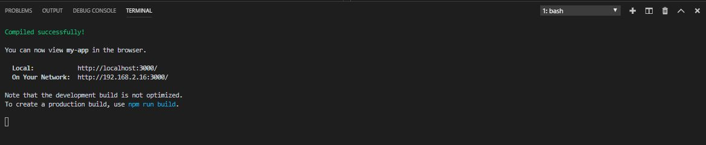
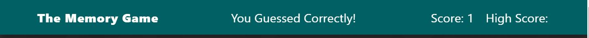
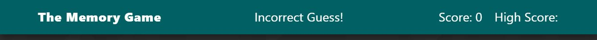

### ClickyGame

### Overview

The ClickyGame is an memory game app where the user picks an image, remembers it and clicks it so that the images all reset. Next, the user has to avoid clicking the image that he had already clicked before and so the number of clicked images increases on each click.

### Technologies
The Technologies that were used in the app include:
* React
* Node Packages through npm install
* CSS
* Git

### Instructions

1. Inside the terminal, go on to the root of the ClickyGame repo and type in npm start to start the react app on localhost: 3000. The message saying 'Compiled successfully!' will show up and the app will popup on the localhost:3000 on the browser:

2. When the player clicks on an image at the start of the game, they get a free point for starting the game as the score goes up by 1. The "CLick an image to begin!" message changes to "You Guessed Correctly!".

3. When the player clicks the image again, the score resets to 0 and the message now says "Incorrect Guess!":

### Known Issues:

* The High Score function is not working at the moment and will be fixed.
